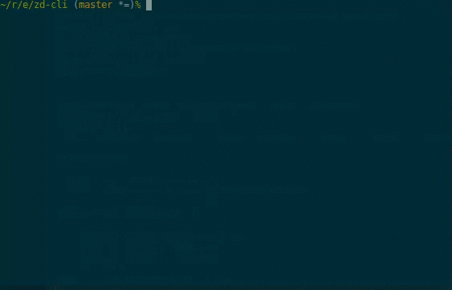

Requirements:

* Ruby - do `bundle install`
* Peco - https://github.com/peco/peco/releases

Put content in `config.rb`:

    ENV['zd_url']='pil.zendesk.com'
    ENV['zd_user']='nk@pil.dk'
    ENV['zd_token']='FL4Fh3st'

Demo - 100% hardcoded as of now:

